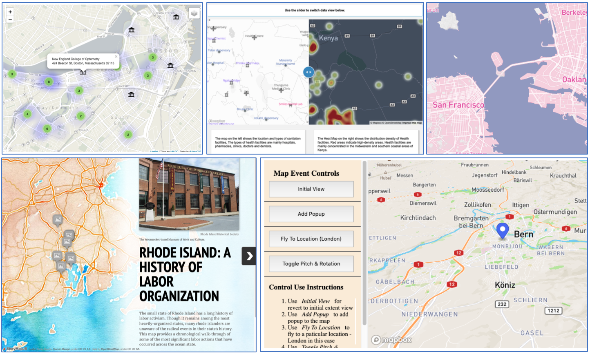

# Online Webmap Course Materials
Need some (mostly) off-the-shelf activities for online teaching about web maps? This repository contains a series of open source activities that can be used to create 4-5 weeks worth of labs/lessons for web mapping and building basic web pages. By the end of these activities, students should:
- have the good understanding of HTML, CSS, JS (specifically [Leaflet](https://leafletjs.com/) and [Mapbox GL](https://docs.mapbox.com/help/glossary/mapbox-gl/)), and Github pages to build and host basic web sites;
- demonstrate proficiency creating a range of web maps with various forms of interactivity; and
- feel confident navigating the building blocks of the Internet: hosting files, client/server relationships, and debugging.

## Required Software / Web Applications
Although all of these activities can be done in-browser, I strongly encourage students to use a code editor (I recommend [Atom](https://atom.io)) and [Github desktop](https://desktop.github.com) to work offline so they don't loose work due to connectivity issues. I recommend instructors survey their students before class to ensure their computing environment and connectivity won’t pose any problems (see [this blog post with sample survey](https://medium.com/@Shadrock/teaching-in-the-time-of-corona-part-i-7bb97ce6c715)).

**To complete these activities students will need:**
- a Github account (we recommend [the student developer pack](https://education.github.com/pack)) for hosting web pages and sharing code,
- a [Mapbox account](https://www.mapbox.com), and
- a Google account for a Google maps embed and for use with some [KnightLab applications](https://knightlab.northwestern.edu/projects/).

 One activity also references embedding [ArcGIS Online](https://www.arcgis.com/index.html) maps from a previous lab of the full course: these are not included here. If you don't have access to AGOL, simply have students embed maps from other sources.

## Contents & Delivery of Activities
There are four folders in this repository labeled according to the week in which they are delivered (e.g. `studio-week1`). We released each folder as a stand-alone Github repository that students would clone or fork into their personal Github account from which to work. Each folder contains starter code that creates a simple web site in which students will construct their maps. The final week (`studio-week4`) requires students to create files from scratch using the previous 3 weeks as a starting point. This teaches students to navigate code and how to host a web site, as they learn to build maps.

The instructions for each week are found in that week's `README` file, which uses a collection of online tutorials. All links work as of May 11, 2020 but should be periodically checked. In some cases, the referenced tutorials used outdated libraries or had small bugs. This was corrected by adding instructions to that week’s `README` file or by linking to additional sources to correct/update code. This accompanied online discussions about debugging code; good documentation; and the sustainability of web map projects.

Each week builds on the previous and, in order, students will learn to:
- set up a basic web site and embed maps from other sources;
- create slippy maps using Leaflet and Mapbox;
- create custom basemap styles and web maps with increasing interactivity; and
- create maps from different data sources.

The folders for weeks 2 and 3 are accompanied by a “solutions” folder that includes examples of successful code. These are helpful as a reference point for instructors not familiar with coding but shouldn’t be given to students up front since all the tutorials cover ample code examples. Finally, there are a few [background lectures](background-lectures/) that provide helpful background information including an incredibly brief overview about “how the Internet works” and “How web maps work.” Both were initially developed by Mapbox and I adapted them as lectures with in-class exercises to get everyone warmed up on the basics.

## Philosophy of the Full Webmapping Course
It may be helpful to understand how these activities fit into the larger scheme of my semester-long class. I teach web mapping and GIS in the context of humanitarian affairs. This means that not all students will go on to become web developers or GISers and may instead become program officers in humanitarian organizations. The primary goal of my full course is to understand how the Internet works and how geography can be mediated by it through visualization. My courses include lectures, readings and discussions on software development, licensing, diversity and inclusivity, low-connectivity environments, the digital divide, and the structure of humanitarian programs. I also introduce students to critical GIS and the emerging “Digital Geographies” conversation ([book here](https://uk.sagepub.com/en-gb/eur/digital-geographies/book258271) | [AAG specialty group here](https://twitter.com/digitalgeogsg)). In preceding courses, I introduce activities about [Human Centered Design](https://www.designkit.org/human-centered-design) and place a heavy emphasis understanding user needs. I challenge students to constantly, and critically, evaluate technology and ask who it is meant to serve, who it actually serves, and why.

During the first month or so of class students are taught to create web maps, layers, web applications, and online surveys using ArcGIS online. Because many of them are working in an ESRI environment, this is important for their ability to match industry standards, but also helps them gain confidence in web mapping without programming. The “studio” activities in this repo are a pivot to a “[flipped class](https://facultyinnovate.utexas.edu/flipped-classroom)” model where I release materials to be reviewed before class, then we focus on working together during the class. I don’t lecture: we just work. The goal is maximum creativity and building things with open source tools. I try to create an environment based on the studio art classes I took as an undergraduate, where class time was devoted to exploring techniques, sharing your ongoing work with others, and spontaneous discussions about what’s working and what’s not.

### Sample student work from the Spring 2020 Studio

## Understand Student Access to Technology & Associated Risks
I watched professors and instructors from all disciplines transition to online teaching in response to the widespread lockdowns and university closures of the 2020 Coronavirus Pandemic with mixed emotions. While I was glad to see so many of them making an extremely valiant efforts, I was also disheartened to see how many of them assumed they would continue to deliver their classes online without any thought to how variable Internet access may be among their students. Nor did I see any of them really consider risks or threats to privacy that their students might be dealing with as a result of the switch to online learning. I wrote [this blogpost](https://medium.com/@Shadrock/teaching-in-the-time-of-corona-part-i-7bb97ce6c715) to provide instructors with a background about why they needed to understand their student’s access to technology and supplied [these draft survey questions and form](https://docs.google.com/document/d/1xcArlcY3EIuTDKAoo4mizWZDsP6t8wpRSMFPTMnVDQU/edit) that can be modified for this purpose.

Please familiarize yourself with the relevant national, state, and institutional policies that govern how student privacy should be protected online. In the U.S., the [Family Educational Rights and Privacy Act (FERPA)](https://studentprivacy.ed.gov/?src=fpco) is a great place to start. Two other great resources for you and your students are [the toolkit for online surveillance self-defense from the Electronic Frontier Foundation]( https://ssd.eff.org) and [“Security in a Box” from the Tactical Technology Collective]( https://securityinabox.org). I’ll update this repo with more resources for online safety and privacy as I find them.   

## References / Citations / Credits
These activities were created as part of my “Web Mapping and Open Source GIS” course at Clark University’s [Department of International Development, Community, and Environment](https://www.clarku.edu/schools/idce/). Everything was developed in collaboration with my course assistant [Priyanka Verma](https://github.com/verma-priyanka/) and we built off of the wonderful [training materials from our good friends at Mapbox](https://github.com/mapbox/web-mapping-curriculum). These activities also build-on or reference great work by: Jakob Zhao ([repo here](https://github.com/jakobzhao/geog371)); Maptime Boston ([repo here](https://github.com/maptimeBoston/leaflet-intro)), Jonathan McGlone ([repo here](http://jmcglone.com/guides/github-pages/)), and [Richard Hinton](https://geography.columbian.gwu.edu/richard-hinton). Please contact me if you find materials where the credit is missing or that you would rather have removed.

The [license for this repo is CC-BY-SA-4.0](https://github.com/Shadrock/webmap-course/blob/master/LICENSE.md), so feel free to use or adapt all of this material in your class or training program! Please contribute via pull request or get in touch with me at shadrock.roberts@gmail.com. Future updates to this repo will include activities using Carto and understanding OpenStreetMap as both contributor and user.
