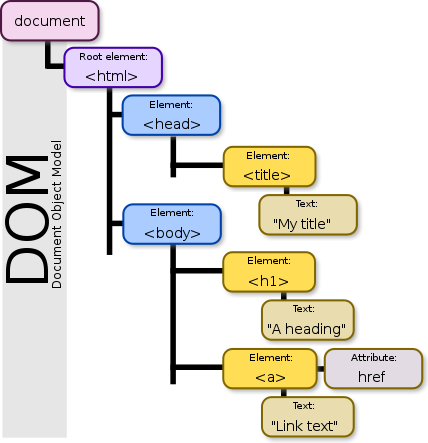

# What is the DOM?
As we began coding our web maps, we'll be working within different sections of web pages that are often denoted with different "tags" such as `<html>`, `<head>`, `<body>`, `<script>`, and `
`. All of these denote certain elements of the page. The name of an HTML element is the name used in angle brackets such as `
` for paragraph. Elements begin with a tag and then end with a "end tag" which is the tag's name is preceded by a slash character, `
`

"DOM" refers to the "[document object model](https://developer.mozilla.org/en-US/docs/Web/API/Document_Object_Model/Introduction)", which helps you organize the elements of your web page or site. It basically represents the hierarchy of elements in your page. It also serves as the interface that allows programs and scripts to dynamically access and update the content, style, and structure of the page.

A visual representation of a DOM might look like this:

Our web maps will be part of web pages and we'll be seeing a lot of elements that are basically containers for different aspects of the page. They provide a high-level structure for our html document, separating metadata, stylesheets, and linked scripts from the body of our page.

One of the most common tags is the `

` tag, which is used to separate out a division or _section_ of an HTML page. Most of the web maps we create will go within a `
` tag. A page can contain many different elements or sections.

## Organize your Directory
While the DOM helps provide structure to a web page, it doesn't provide a structure for various files that might be needed to create a complete web page. So think about how to structure the files for your website up front; a messy file structure will mean messy code.

A web directory should be organized in, more or less, the following manner:
- `index.html` file: When a browser requests your web page, your server will return the `index.html` file stored in the root directory, the directory that holds all of your other directories. Think of this as the front door to your website.
- an images folder for holding any images that you embed in your web pages.
- a `css` folder to hold any specific style sheets.
- other folders as needed. It's common to see other folders to hold specific scripts (e.g. labeled "Javascript").

## Further Reading
We'll be going through the basics of HTML, CSS, and Javascript in class. However, understanding the DOM and the hierarchy of your web pages will help you create better pages. For more details on the basics of HTML, CSS, and other "front end" web technologies see the [excellent walkthrough provided by Mozilla](https://developer.mozilla.org/en-US/docs/Learn/Getting_started_with_the_web/HTML_basics) or [this fantastic overview from MIT](http://duspviz.mit.edu/web-map-workshop/code-your-first-website/).
