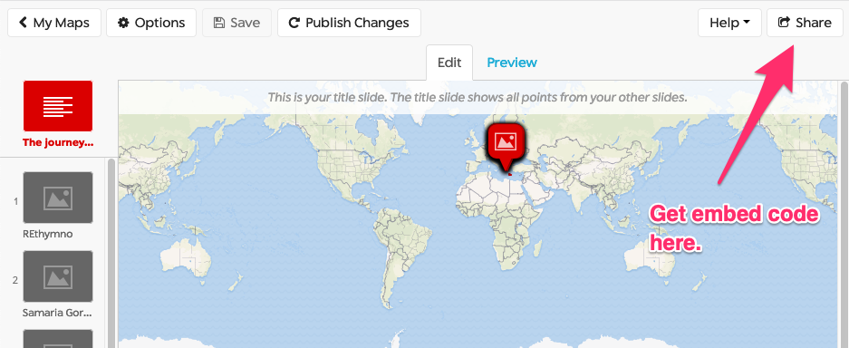
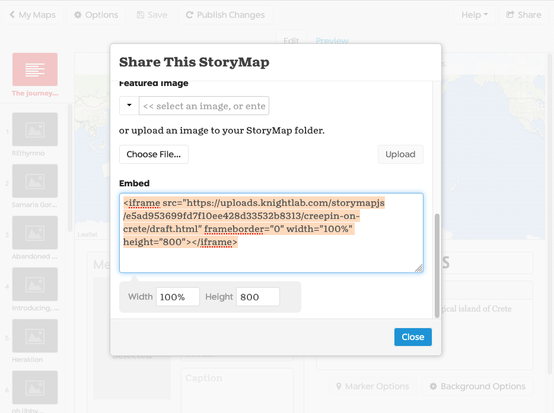
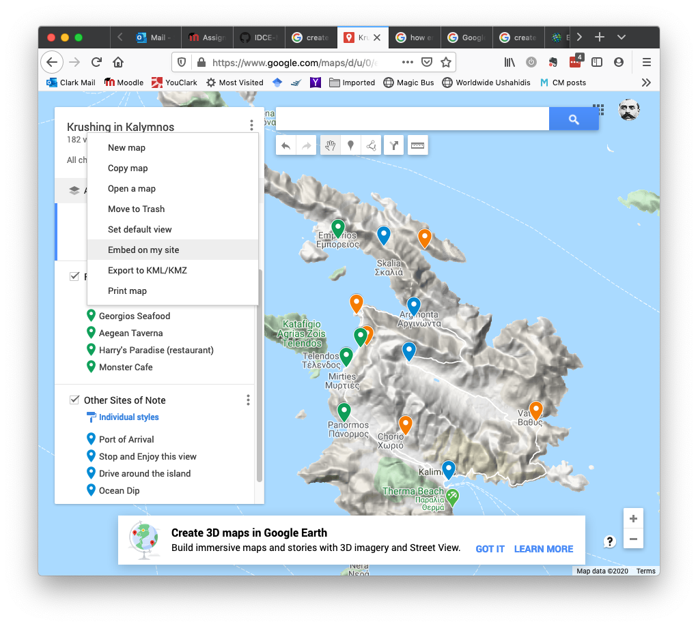

# Welcome to the Studio Week 1!
Building on our lectures about “How the Internet works”, you will create and host a website this week. The goal is to get familiar with how the different pieces of a website work (e.g. HTML files, the .CSS files, etc) and be able to connect these things to create a website. Because web maps live on the web, this will provide you with a good foundation for creating custom maps and using existing ones.

To start with, fork a copy of this repository into your account ([click here if you don't remember what that means](https://help.github.com/en/github/getting-started-with-github/fork-a-repo)). While you can do this entire set of exercises in browser, I highly recommend _cloning a local copy_ to your desktop that you can work with even if you are not connected to the Internet ([click here if you don't know what that means](https://help.github.com/en/desktop/contributing-to-projects/adding-and-cloning-repositories)).

## Expected Outputs for this week / what to submit:
Listed below are links to different tutorials and resources that you can use to build your web site, including details embedding some of your previous labs! The expected output for the end of this week is a website with a few embeds, including:
- your KnightLab visualization (lab 1 - If you haven't created a KnightLab Storymap yet; [make one here](https://storymap.knightlab.com) or [go here to create a Timeline](https://timeline.knightlab.com/));
- your 311 incidents feature layer (lab 5);
- along with two new items that you will need to create, then embed, in your web page: a basic dataset in GeoJSON and a Google map.

**At the end of the week you will submit a link to your web site via Moodle.** See tutorials / instructions below and happy coding!

## Tutorials / Instructions

1. **To create your web site**, you will follow [this great tutorial](http://jmcglone.com/guides/github-pages/) by @jmcglone. Your website will be created and hosted using [Github Pages](https://help.github.com/en/github/working-with-github-pages/about-github-pages): it is a "user site" that lives in a Github repository in your *personal* account (see more on Github pages types and limits below). About half of the tutorial uses basic HTML and the other half uses a relatively new technology called [Jekyll](https://jekyllrb.com/docs/github-pages/), which uses [Markdown](https://www.markdownguide.org/getting-started/) (the way we style the text in Github repositories) in combination with HTML. Once you’ve completed the tutorial, make some changes to the website: change the fonts, the colors, anything you like. If you want to take things even further see the “additional resources” section below for how to use web templates for professional looking sites and you could completely redo your site with a template.  
2. **Embed a KnightLab Storymap or Timeline,** [follow the instructions for embedding the Timeline](https://timeline.knightlab.com/) (scroll down to step #4) or click the “share” button in the upper right hand corner of your Storymap (see image below) and scroll down to get the embed code for your web page.

3. **To Embed AGOL Feature Layer from Lab 5** [follow this video](https://www.esri.com/videos/watch?videoid=jIY06GN7XkM&title=arcgis-com-embedding-a-map-in-your-website) (and try not to get creeped out by the narrator’s voice): or [follow ESRI’s written instructions](https://doc.arcgis.com/en/arcgis-online/share-maps/embed-maps-groups.htm).
4. **To embed your Google map**, first... create a Google map with some customized pins and a preferred base map! Start by [creating your map here](https://www.google.com/maps/about/mymaps/). When you're finished with it get the embed code (see below) and remember that you can change the height and width by passing arguments in the URL... remember the lecture on changing Google maps by changing the URL?

For an example of a “custom” Google map [have a look at this one I made](https://www.google.com/maps/d/u/0/edit?hl=en&mid=1tPh_AQ3bIpFUOzXtXzhnJfbYrYQnne5l&ll=37.008808047029%2C26.935363552731246&z=12) to share a trip my wife and I took with our friends. Why is it good to know how to embed Google maps? Because they are ubiquitous and super easy to use– sometimes that’s all you need. Secondly, by forcing you to create a Google map you have to make some really careful symbology decisions with a limited amount of choice. Finally, some web sites only allow for web maps through Google: my wife and I had a wedding web site that did this!
5. **To create a GeoJSON data set and web map embed** there are a few steps:
  * First, learn about GeoJSON (hint: it's a geographic data format that's super important for open source web maps) by [reading this short blog post](https://leafletjs.com/examples/geojson/) and / or [this slightly more detailed one](https://macwright.org/2015/03/23/geojson-second-bite.html).
  * Create a GeoJSON data set. You can do this a few ways. I'd recommend starting with something quite simple: maybe just 10 points, or polygons. The data can be real or something you just make up. You can [create GeoJSON via this web interface](http://geojson.io) (which is also really good for checking to make sure a GeoJSON file you have is rendering properly); you can [convert `.shp` files to GeoJSON with ArcPro using these instructions](https://pro.arcgis.com/en/pro-app/tool-reference/conversion/features-to-json.htm); you can convert `.shp` files to .`kml` or `kmz` files (commonly used by Google Earth) and [convert them using Ogre](http://ogre.adc4gis.com), which also converts `.gpx` or `.csv` files; you could zip a `.shp` file and convert the zipped file to GeoJSON using [https://mapshaper.org/](https://mapshaper.org/) or [http://gipong.github.io/shp2geojson.js/](http://gipong.github.io/shp2geojson.js/); and if that's not enough you can search online yourself!
  * Once you've created and saved your `.geojson` file, all you have to do is [put it in your Github repo and link to it](https://help.github.com/en/github/managing-files-in-a-repository/mapping-geojson-files-on-github)!

## Additional Resources.
There are other tutorials for how to create a website in Github and if, for any reason, you'd like to use a different tutorial, you're welcome to: I'd suggest using [Github Pages tutorial from Github here](https://lab.github.com/githubtraining/github-pages). For even more information on how to host web maps, our good friends at Mapbox have put together [a few other resources, which you can investigate here](https://labs.mapbox.com/education/how-to-host-a-web-map/).

After successfully following the tutorial and launching your website, you can take things further. For example you could:
- Change your .css file (you'll know what this means after the tutorial) to make the font sizes and colors different.
- You could decide to use a pre-set theme or template for your website: Github offers some built in themes [see examples here](https://help.github.com/en/github/working-with-github-pages/adding-a-theme-to-your-github-pages-site-using-jekyll) or the ability to [use any other theme you can find](https://github.blog/2017-11-29-use-any-theme-with-github-pages/)... see some [nice free themes here](https://jekyllthemes.io/free).
- You could also use the vast range of free .css templates ([examples here](http://www.csszengarden.com/)) or HTML templates ([example here](https://html5up.net/)) to create a totally different type of site. One easy way to do this is to fork somebody else's site and change it: here's a [great tutorial and repo for just that](https://blog.usejournal.com/set-up-your-portfolio-website-in-less-than-10-minutes-with-github-pages-d0efa8ff56fd)!

## Info about "Github Pages" types and limits
There are three types of GitHub Pages site: project, user, and organization. Every Github account may have *one* user site, *one* organizational site, and multiple project sites.

- User and organization sites are always published from a repository named `<user>.github.io` or `<organization>.github.io`. Unless you're using a custom domain, user and organization sites are available at `http(s)://<username>.github.io` or `http(s)://<organization>.github.io`. For example, if I wanted to create my own portfolio site, I would create a repo called `shadrock.github.io` which would then be rendered at `http(s)://shadrock.gitub.io`.
- Project site are stored in the same repository as their project. Unless you're using a custom domain, project sites are available at `http(s)://<user>.github.io/<repository>` or `http(s)://<organization>.github.io/<repository>`. For example, if I had a repo called `final-project` in my account and wanted to create a special site just for it, it would be called `shadrock.github.io/final-project`.

The limits for websites are fairly small (under 1GB) but if you're not hosting lots of images or data, you can build out quite a nice little site. See the [Github documentation](https://help.github.com/en/github/working-with-github-pages/about-github-pages#types-of-github-pages-sites) for further details.
