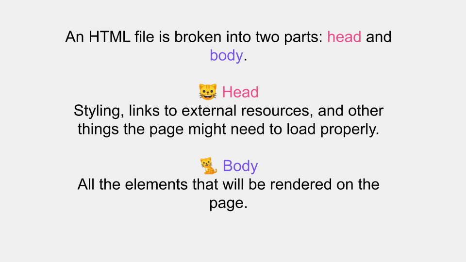
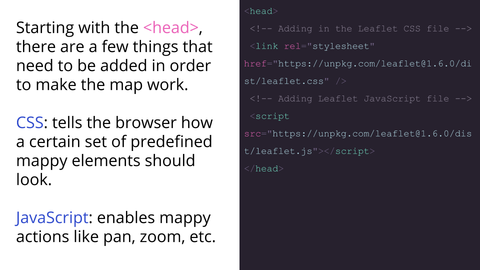
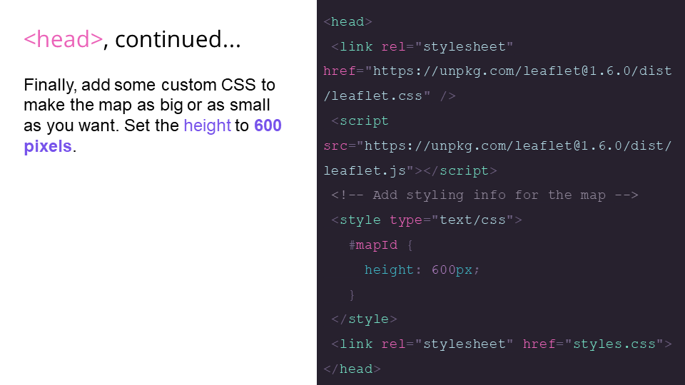
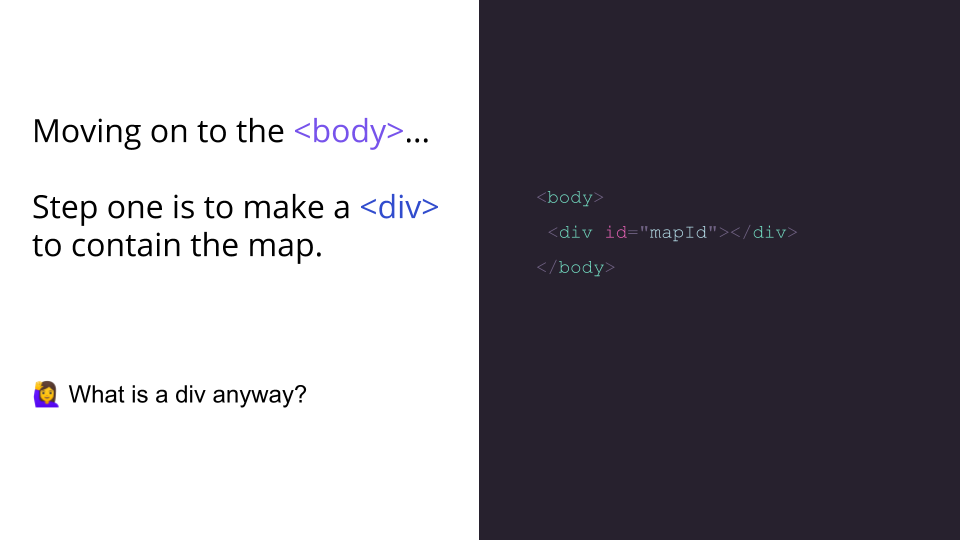
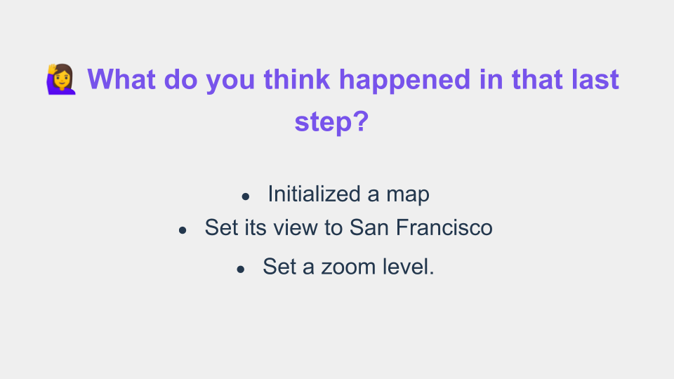
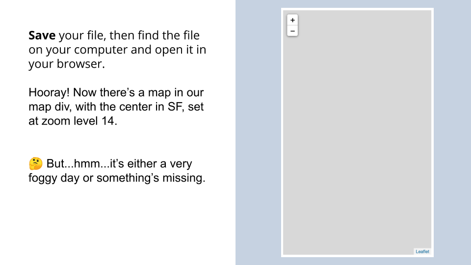
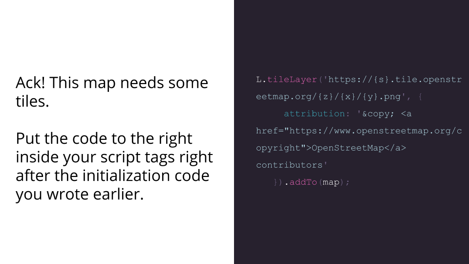

# Raster tiles with Leaflet

- Head to http://bit.ly/leaflet-basic in a new tab.
- View the page’s source code: right-click anywhere, then click "View Page Source."
- You can use code you see as a guide, along with the instructions below. It's very common to look at code you already know works in order to help you solve problems when you are coding your own page!

### Initialize your first web map
1. Fire up your text editor. In the labs we have Visual Studio Code (aka “VS Code”), which we will reference here. However, you can use any editor you like at home (or on your own machine). Twi we discussed in class are [Webstorm](https://www.jetbrains.com/webstorm/), which Priyanka likes or [Atom](https://atom.io/), which Shadrock uses. Web mappers rely heavily on their text editors to get stuff done. We’re going to use ours a lot during this class.
2. In VS Code, add the folder containing all of today’s class materials to your Workspace (you should have downloaded this from GitHub already): From the File menu, click Add Folder to Workspace, then navigate to today’s class folder on your computer and click Add.
3. Open `index.html`




##### 4. Set the size for map


```css
#mapId {
     height: 600px;
   }
 ```

##### 5. Create div element that contains the map

```html
<div id="mapId"></div>
```

##### 6. Initialize the map on the _mapID_ div with a center and zoom

```js
var map = L.map('mapId').setView([37.754700, -122.420790], 14);
```

##### 7. Load map

##### 8. Add a basemap to your map

``` js
L.tileLayer('https://{s}.tile.openstreetmap.org/{z}/{x}/{y}.png', {
     attribution: '&copy; <a href="https://www.openstreetmap.org/copyright">OpenStreetMap</a> contributors'
   }).addTo(map);
```

##### 9. Save your file and open the file in a browser. 

##### Neat! You’re looking at the default tiles from [OpenStreetMap](https://www.openstreetmap.org/#map=5/38.007/-95.844). 

## Additional Resources
What if you want to add different tiles? You can do that! Here’s another 😎 cool example from [Stamen](https://stamen.com/). Find more examples [here](https://leaflet-extras.github.io/leaflet-providers/preview/).
