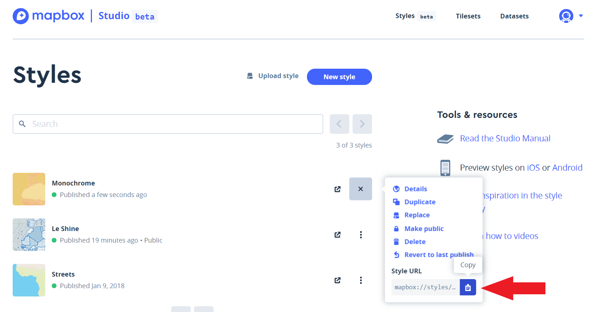

### Creating a Custom Mapbox Style
- [Follow the Mapbox tutorial for creating a custom style](https://docs.mapbox.com/help/tutorials/create-a-custom-style/?utm_medium=sem&utm_source=google&utm_campaign=sem%7Cgoogle%7Cbrand%7Cchko-googlesearch-pr01-dynamicsearchcampaign-nb.broad-all-landingpage-search&utm_term=brand&utm_content=chko-googlesearch-pr01-dynamicsearchcampaign-nb.broad-all-landingpage-search&gclid=Cj0KCQiA-bjyBRCcARIsAFboWg0c06wf34jAP1XV8i53wUBsfaO3P-sB5wC7sPMMxcgBtUjstEN5330aAuPhEALw_wcB), which will walk you through creating a map using Mapbox corporate colors. 
- Once you've done this, your next step will be to create another style to match the corporate colors of your favorite international development, environmental, humanitarian, or non-profit organizations. For example, if I wanted to make a map for the U.S. Agency for International Development, I'd do some online research to see if I could find any "branding" or "design guidelines" ([like this](https://www.usaid.gov/sites/default/files/documents/1869/USAID_GSM-02_04_2020.pdf)), which might give me specific information on the colors they use. If I *couldn't* find any branding guidelines for my favorite organiztion, I might try [entering the organization's URL into a website that would crawl the code to pick out specific colors](https://www.colorcombos.com/grabcolors.html) or use a [web browser extension to select colors on screen and find out what they are](https://chrome.google.com/webstore/detail/eye-dropper/hmdcmlfkchdmnmnmheododdhjedfccka?hl=en). You could also use the [developer tools built into Google Chrome](https://developers.google.com/web/tools/chrome-devtools/) or [in Mozilla Firefox](https://developer.mozilla.org/en-US/docs/Tools) (my favorite browser!) that we looked at in class to inspect elements of a web page including the HTML and .css files. In any case, make your webmap sing with the colors of your favorite organization!
- I know what you're thinking, "but Shadrock - I want to learn more about color!" Never fear. Visit [Color Brewer](https://colorbrewer2.org) for picking perfect colors based on data and classes. Use [http://palettr.com/](http://palettr.com/) for generating a color palettes by keywords or place names; [http://colorpalettes.net/](http://colorpalettes.net/) for generating warm, cool, pastel or contrasting color palettes. Two other great colo scheme generating sites are [https://javier.xyz/cohesive-colors/](https://javier.xyz/cohesive-colors/) and [https://coolors.co/](https://coolors.co/).

### Adding Custom Mapbox Style to Page
Once you have created a custom style using Mapbox, you'll need to add it to your web page. To do this, you will need your custom style's Style URL. 

1. Find the custom style you published in the last step here: https://studio.mapbox.com/

2. Click on the three dots next to your style and copy the Style URL 

3. Add the Style URL to your map's style property (line 49) in `Mapbox-gl-js-bm.html`

4. Add your Mapbox access token (line 38)

5. Add some text to your web page (preferably underneath the web map) with links to the organization you choose to create a custom map for; a style document or guide for their colors, or which tool you used to define the colors; and a few words about any other color choices you made. 

6. Save your changes and load your page
