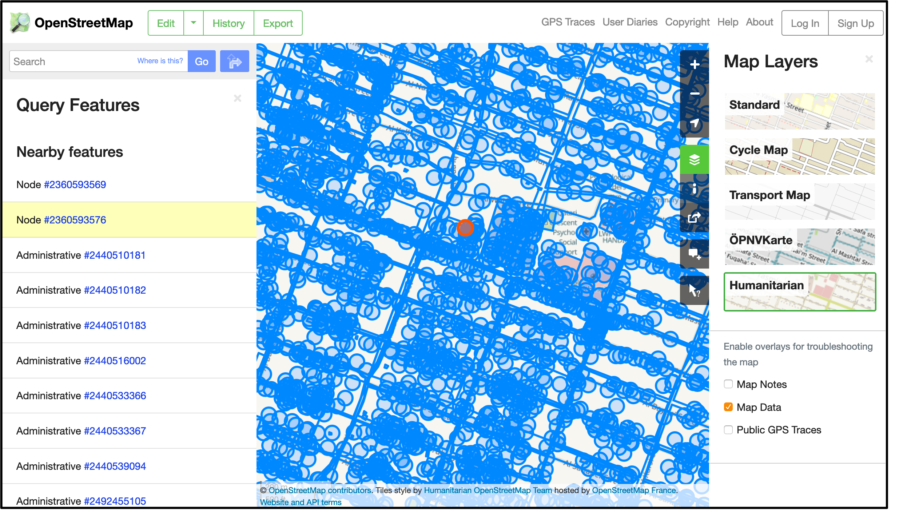

# Welcome to the Studio Week 5!

Last week we focused on data sources for your maps and creating custom maps from the ground up. This week, we'll be continuing to look at data with a deep-dive into [OpenStreetMap](https://www.openstreetmap.org/) or "OSM". In this tutorial we'll learn about the structure of OSM data, how to search for data we want, and download specific data for Zaatari refugee camp in Jordan. You can [view Zaatari on OSM here](https://www.openstreetmap.org/#map=15/32.2931/36.3227&layers=H) or learn more about the camp on the [official UN web page here](https://data2.unhcr.org/en/situations/syria/location/53).

**What you will need:**
- an OSM account.
- a Github account for hosting website and data.
- a Mapbox account.

## Expected Outputs for this week / what to submit:

You will submit a link to your Github repo and the working website that it hosts. There are no rules about the website other than it must contain a map using OSM data. You can design any style web map you like, using any of the techniques or technologies we've learned so far.

# What's the deal with OSM data?
OpenStreetMap is a somewhat misleading name since it's more than a map, it's a huge crowdsourced database! What you see on the [OpenStreetMap homepage](https://www.openstreetmap.org/) - or other OSM tilesets for that matter - is a _selection_ of data available in the OSM database. For example, some people focus on features in the database related to [cycling](https://www.thunderforest.com/maps/opencyclemap/), while others focus on [humanitarian features](http://map.hotosm.org/#15/32.2916/36.3341). You can see [a list of OSM tiles here](https://wiki.openstreetmap.org/wiki/Tiles) and view a few of the different tiles on the OSM homepage under the *Layers* icon on the right side of the screen. To see the underlying data of a particular area (including data that aren't shown on the map), you can check the "Map Data" box. Be careful, though: depending on the area you are looking at, you may load tens of thousands of data points and crash your browser!

The example below shows how to view the Humanitarian OSM layer and see underlying data of Zaatari refugee camp in Jordan.

## The Structure of OSM data
OSM data are made of "elements" that are based on a "node" (analogous to points for GIS folks). Nodes can be separate or can be connected to create:
- _Ways_: a connected line of nodes (analogous to polylines). Used to create roads, paths, rivers, and so on.
- _Closed_: ways that form a closed loop (usually created to form areas).
- _Areas_: closed ways which are also filled (analogous to polygons).
- _Relations_ that can be used to create more complex shapes, or to represent elements that are related but not physically connected.

For more details on these elements see this [OSM wiki page](https://wiki.openstreetmap.org/wiki/Elements).

All these elements can carry **tags**, which is a key=value pair describing what the element is. For instance, mapping a mobile phone store can be done by creating a node, and adding the following tags: `shop=mobile_phone`, `name=John Smith's phone centre`. For more details on tags see this [OSM Beginners Guide](https://wiki.openstreetmap.org/wiki/Beginners_Guide_1.3).

## Getting Data with Overpass Turbo
Now that we understand nodes and tags, we can find out what sort of data we want to get! There are a variety of ways to get at OSM data, but we'll be using [Overpass Turbo](http://overpass-turbo.eu/), which is an interactive query generator. The basics process for using Overpass Turbo is:

1. Zoom to the appropriate region on the map.
2. Enter your query in the left side of the page and trigger any actions using the buttons at the top. Your query will search OSM tags for the elements you want. If you are new to the query language use the wizard (we'll do this below).
3. Preview your data
4. Export your data!

The OSM wiki contains a [full description of the syntax of the query language](https://wiki.openstreetmap.org/wiki/Overpass_API/Overpass_QL) and a [collection of examples](https://wiki.openstreetmap.org/wiki/Overpass_API/Overpass_API_by_Example). Additionally, Mapbox has a nice page that walks through [using Overpass Turbo to get specific features from a ski resort](https://docs.mapbox.com/help/tutorials/overpass-turbo/).

## Data for Zaatari Refugee Camp
Now that we understand the role of tags for OSM data, we'll need to find the proper tags for the features we want. In general, you can do this by opening OSM and clicking a feature to find its tags, or by searching the [OSM Map Features wiki](https://wiki.openstreetmap.org/wiki/Map_Features) to find the keys and values that most closely resemble the features you want to query.

There are a significant number of humanitarian organizations that contribute to OSM through various projects. Well documented projects will have associated Wiki pages, such as [Missing Maps](https://wiki.openstreetmap.org/wiki/Missing_Maps_Project): a collaboration between the Humanitarian OSM Team (or "HOT"), and partners such as The American Red Cross, British Red Cross, and Médecins Sans Frontières. Another example is refugee camp mapping done by [REACH](https://www.reach-initiative.org/what-we-do/), which is an organization often supported by the United Nations to conduct field surveys or map refugee camps.

Searching OSM wiki for "REACH camp mapping" takes us to [the page for refugee camp mapping](https://wiki.openstreetmap.org/wiki/Refugee_Camp_Mapping#Common_Tags_for_Site), which includes tags, and a case study of Zaatari refugee camp: perfect! The tags used for refugee camp mapping provide a wide range of information important for humanitarian programs. Let's take a closer look at the [elements relating to water](https://wiki.openstreetmap.org/wiki/Refugee_Camp_Mapping#Drinking_Water).

Water distribution in refugee camps is critical and mandated by the [SPHERE standards](https://spherestandards.org/), which sets standards for humanitarian action to promote quality and accountability. The SPHERE handbook sets forth standards such as how much water the resident of a camp should have access to and a maximum distance that one should have to travel to access water: less than 500 meters ([see the handbook chapter on water here](https://handbook.spherestandards.org/en/sphere/#ch006_004)).

A practical GIS analysis of water accessibility in a refugee camp, then, is ensuring that all portions of the camp are within 500 meters of a water distribution point of some sort. To do this, we need to find those nodes! There are several different tags for water in OSM, but we'll focus on `amenity=water_point` and `amenity=drinking_water`.

**Let's get some data:**

1. Start by using the search tool in Overpass to locate `zaatari, jordan`. The search tool is located on the map to the right of the zoom buttons.
2. Once you've located and zoomed to Zaatari, zoom in to see some of the features, then zoom out until the whole camp is within the Overpass map view.
3. Click the **Wizard** button from the toolbar and paste the following statement in the Query Wizard window: `amenity=water_point OR amenity=drinking_water` since these are the keys and values we found in the camp mapping wiki.
4. Click **Run** and Overpass will highlight the features on the map. You can click on individual nodes to see more information about them (see example below).

Additionally, you can select the **Data** tab (next to the **Map** tab in the upper right hand side of the map view) to more closely inspect the data (see example below)

5. Once everything looks good, export them by clicking the **Export** button in the toolbar, and select GeoJSON.

Although we've previewed our data, you can also check your downloaded data by viewing it in https://geojson.io or using [Github to automatically render a GeoJSON file in a repo as a map](https://docs.github.com/en/free-pro-team@latest/github/managing-files-in-a-repository/mapping-geojson-files-on-github). Congrats: you've got data! Happy mapping!

# Citations & Further Info
This tutorial pulled text from a variety of sources including the [Mapbox tutorial on incorporating OSM data](https://docs.mapbox.com/help/tutorials/overpass-turbo/), the [LearnOSM web page for OSM data](https://learnosm.org/en/osm-data/), and the [OSM Beginners Guide](https://wiki.openstreetmap.org/wiki/Beginners_Guide_1.3).
